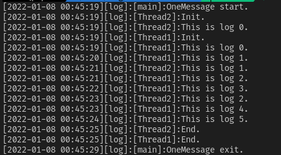

# OneMessage

一个基于 `发布-订阅`模型的多线程消息框架，用于嵌入式平台，纯C语言编写，性能和灵活性极高

------------------------------------------------------------------------

## 系统支持

已在Linux,FreeRTOS上成功运行，欢迎适配到其他平台。

* 简单示例
  * [example for linux(use cmake)](https://gitee.com/jiu-xiao/msg-example.git)
  * [example for stm32f103(use makefile)](https://gitee.com/jiu-xiao/om-example-mcu.git)
* 使用本框架的开源项目
  * [青岛大学Robomaster机器人嵌入式开源](https://gitee.com/qdu-rm-2022/qdu-rm-mcu)

## 特性

* 发布-订阅

  * 底层由红黑树+链表实现，查找与遍历都有良好的性能表现
  * 话题为操作的主体，匿名发布且不限制订阅者数量

* 安全性
  * 保证线程安全
  * 允许在中断中使用
  * 提供静态API，可以实现无动态内存分配

* 消息过滤器

  * 支持为每个话题和订阅者注册过滤器，只接受符合条件的消息
* 订阅回调

  * 订阅者可在接收时调用用户回调函数，暂存数据或者转发到另一个话题。
* 快速配置

  * 使用格式化输入的方式配置话题，极少的代码量就能实现整个消息网络的搭建
* 事件触发

  * 以订阅为核心的事件触发器，在保证执行效率的同时，一个触发条件可以对应多个处理函数。
* 批量筛选

  * 对于条件简单且分支较多的话题，可开启高级过滤器而不需要注册大量函数，现已支持 `列表`、`范围`、`分解`模式。
* 日志框架

  * 使用示例程序打印的日志：

## 获取源码

克隆这个仓库

[Gitee](https://gitee.com/jiu-xiao/one-message.git)

[Github](https://github.com/Jiu-xiao/OneMessage.git)

```
git clone https://gitee.com/jiu-xiao/one-message.git
```

或者使用 `git submodule`将其包含在你的仓库中

```
git submodule add https://gitee.com/jiu-xiao/one-message.git <path>
```

## 代码结构

```
OneMessage
├─config
├─src
│  ├─app
│  ├─comp
│  └─core
└─test
```

---

| 文件夹   | 功能         |
| -------- | ------------ |
| config   | 配置文件模板 |
| doc      | 文档         |
| src/app  | 应用         |
| src/comp | 组件         |
| src/core | 核心api      |
| src      | 用户接口     |
| test     | 单元测试     |
| example  | 例程         |
| utils    | 工具         |

## 文档

> [配置文件](doc/config.md)

> [使用说明](doc/user.md)

> [开发文档](doc/dev.md)

## 这个项目的意义

在复杂的工程中，为了实现线程的通信和数据的同步会耗费掉大量的开发时间，但往往bug都会出现在这些地方，所以需要找到一个稳定可靠的方案。OneMessage即是解决这个问题的一次尝试。
